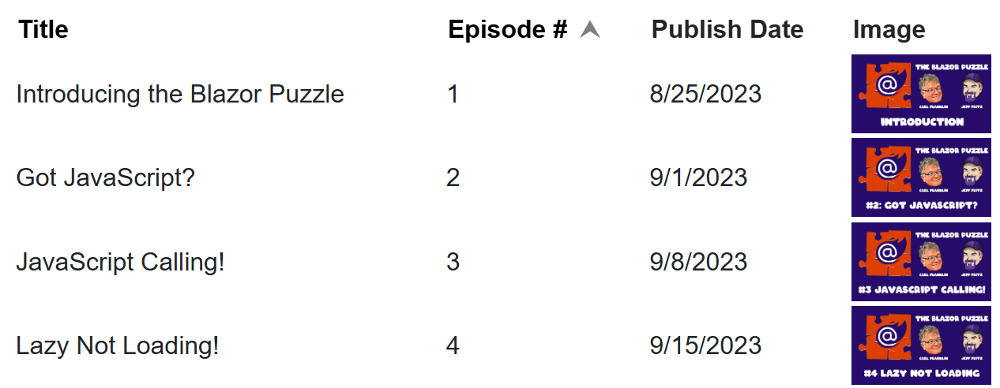

# Puzzle-69 - A QuickGrid of All Sorts
The Blazor QuickGrid let's you set up tabular data for presentation, and it also has a sorting feature.  You'll want to review this puzzle to make sure you're getting the most from your QuickGrid sort experience

YouTube Video: https://youtu.be/r8-WjkvphX0

Blazor Puzzle Home Page: https://blazorpuzzle.com

## The Challenge

We've got a grid of some of our first episodes here and we'd like to add some sorting to it.

The title and episode number columns already have a sort on them and they work great sorting by strings and by numbers.  What about the published date column?  How do we add sorting capabilities to that column so that it sorts dates properly?
